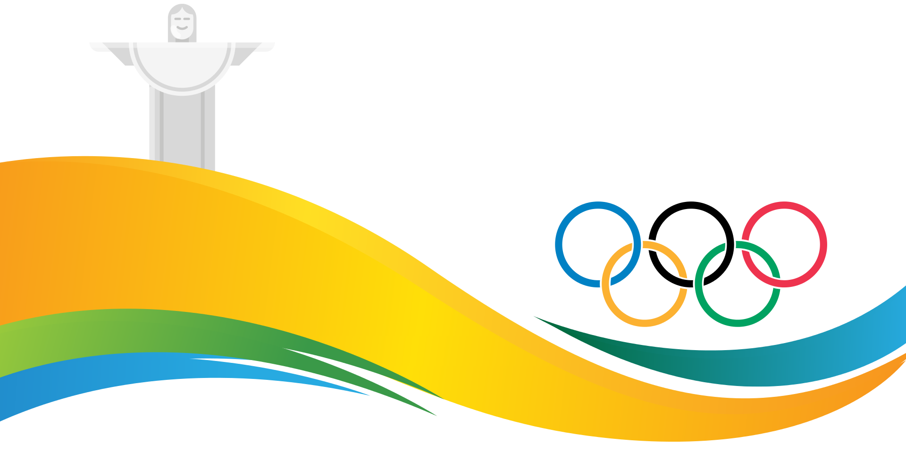

# RUSSIA OLYMPIC STATISTIC

## Olympic DataViz project

### What is it about?
># This is an infographic page that shows `analysis of Russia's olympic data.` It is build with *html, css and python*.
You can the the comparison between Russia and other countries in terms of medal counts, Russia's leading sports and also comparison between men and women.

Check [Roadmap](https://docs.google.com/document/d/1xPCAHoDTDvL3k1zlWYEUvaUqgUjOU4mxR9ViN8fh_Uk/edit#) for more information.

### Prerequisites
All you need is a browser.

### Author
1. Petrova Elina 

### License 